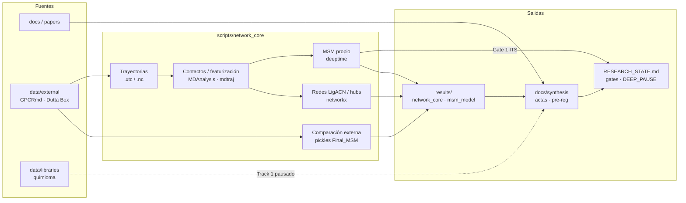

# Janusforge

[](https://www.python.org/downloads/)
[](https://mamba.readthedocs.io/en/latest/user_guide/micromamba.html)
[](https://www.mdanalysis.org/)
[](https://deeptime-ml.github.io/)
[](https://github.com/Juanki58/janusforge)
[](https://doi.org/10.1038/s42003-023-04868-1)

Descubrimiento computacional de **Janus cannabinoids** (ligandos *Yin-Yang*): perfil dual

- **CB1 (CNR1)** — antagonista
- **CB2 (CNR2)** — agonista

Prioridad actual del repo: **mecanismo conformacional de CB2** (topología de contactos, redes, MSM propio sobre trayectorias GPCRmd). El cribado de ligandos / docking está **congelado** (`DOCKING = STOP`).

> Badge DOI: referencia bibliográfica a Dutta & Shukla 2023 (comparación externa MSM), **no** un DOI del proyecto.

---

## Stack real

| Capa | Tecnología |
|------|------------|
| Lenguaje | **Python 3.12** |
| Entorno | **micromamba** / conda-forge (`janus_p1` para red/MSM; `janus_md` para OpenMM) |
| Trayectorias | **MDAnalysis**, **mdtraj** |
| MSM | **deeptime** (tICA → K-means → MSM → ITS / PCCA+) |
| Grafos | **networkx** |
| Química (Track 1, pausado) | RDKit, PyYAML, pandas (`requirements.txt`) |
| MD soluble/membrana | OpenMM + AmberTools — Linux/WSL/Docker (`environments/environment-md*.yml`) |
| Notebooks / docs | Markdown + Git; resultados en `results/` |

**No** hay Docker Compose, Cargo ni Tauri en este repo.

---

## Estado científico (corto)

Autoridad de freeze: [`RESEARCH_STATE.md`](RESEARCH_STATE.md) · roadmap: [`docs/synthesis/RESEARCH_ROADMAP.md`](docs/synthesis/RESEARCH_ROADMAP.md)

| Flag | Valor |
|------|--------|
| `DEEP_PAUSE` | **TRUE** (repo sellado; compute solo con autorización PI acotada) |
| `DOCKING` / `DE_NOVO` | **STOP** |
| P1 hubs dinámicos | **CLOSED (NOT_SUPPORTED)** |
| P2 MSM (GPCRmd WT) | **CLOSED (INSUFFICIENT_SAMPLING)** — ITS no convergente |
| P2 redes A/B/C | **ABORTED** |
| Arquitectura estructural A/B/C | **NOT DECIDED** |

---

## Arquitectura de datos



Flujo honesto: **papers/external → trayectorias / pickles MSM → `scripts/network_core` → `results/` → síntesis**. Las compuertas epistémicas (`P2_INSUFFICIENT_SAMPLING`, `DEEP_PAUSE`) impiden inventar narrativa biológica sobre muestreo insuficiente.

---

## Quickstart (Windows-friendly)

### 1. Clonar

```powershell
git clone https://github.com/Juanki58/janusforge.git
cd janusforge
```

### 2. Entorno de análisis CB2 (red / MSM)

```powershell
# Instalar micromamba si no lo tienes: https://mamba.readthedocs.io/
micromamba create -y -f environments/environment-network.yml
```

En este clon también se usa el binario local `.\.micromamba\micromamba.exe` (no versionado de forma obligatoria).

### 3. Smoke test (sin trayectorias)

```powershell
micromamba run -n janus_p1 python scripts/network_core/dynamic_pipeline.py --self-test
```

Debe imprimir `[PASS]` en los tests sintéticos y escribir `results/network_core/dynamic_pipeline_selftest.json`.

### 4. Scripts de trabajo (requieren datos locales)

| Objetivo | Comando |
|----------|---------|
| MSM propio P2 (GPCRmd) | `micromamba run -n janus_p1 python scripts/network_core/p2_msm_builder.py` |
| Comparación cinética Dutta Final_MSM | `micromamba run -n janus_p1 python scripts/network_core/external_dutta_msm_compare.py` |

Los `.xtc` / pickles / zips grandes viven bajo `data/external/` y **no** se clonan por defecto.

### Química / docking (pausado)

```powershell
pip install -r requirements.txt
# OpenMM MD: environments/environment-md.yml — Linux/WSL/Docker (AmberTools ≠ win-64)
```

`DOCKING = STOP` — no es el camino activo bajo `DEEP_PAUSE`.

---

## Estructura (orientativa)

```
janusforge/
├── configs/                 # parámetros CB1/CB2, fibrosis/IPF
├── docs/                    # norma, quimioma, síntesis, pre-registros
├── data/
│   ├── external/            # GPCRmd, Dutta MSM/traj (local, pesado)
│   ├── libraries/           # semillas / controles
│   └── targets/             # estructuras receptor
├── environments/            # conda/micromamba (network, MD)
├── notebooks/
├── results/                 # network_core, msm_model, reports
├── scripts/
│   └── network_core/        # P1/P2, satélites, comparación externa
├── src/                     # módulos Track 1 (cribado / ADME)
└── RESEARCH_STATE.md        # autoridad de freeze
```

---

## Documentación clave

| Documento | Rol |
|-----------|-----|
| [`RESEARCH_STATE.md`](RESEARCH_STATE.md) | Freeze / flags / actas |
| [`docs/README.md`](docs/README.md) | Índice de docs |
| [`docs/guia_maestra_biotecnologia_quimiotipos.md`](docs/guia_maestra_biotecnologia_quimiotipos.md) | Norma Nivel 0 (Track 1 vs Track 2) |
| [`docs/quimioma_cannabico_cb1_cb2.md`](docs/quimioma_cannabico_cb1_cb2.md) | Brújula química |
| [`docs/literatura_fibrosis_cb1_cb2.md`](docs/literatura_fibrosis_cb1_cb2.md) | Memoria fibrosis / ECS |
| [`docs/synthesis/RESEARCH_ROADMAP.md`](docs/synthesis/RESEARCH_ROADMAP.md) | Roadmap P1–P6 |

## Targets

| Receptor | Rol deseado | UniProt | Estructura ejemplo |
|----------|-------------|---------|-------------------|
| CB1 (CNR1) | Antagonista | [P21554](https://www.uniprot.org/uniprotkb/P21554) | [5TGZ](https://www.rcsb.org/structure/5TGZ) |
| CB2 (CNR2) | Agonista | [P34972](https://www.uniprot.org/uniprotkb/P34972) | [6PT0](https://www.rcsb.org/structure/6PT0) |

## Relación con otros repos

Proyecto **independiente** de [molforge](https://github.com/Juanki58/molforge). No es un branch ni subcarpeta de molforge.
