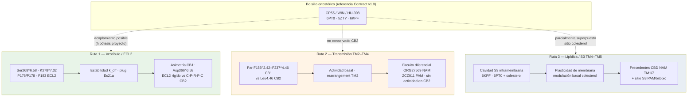

# CB₂ — Mapa mecanístico del conmutador alostérico (landscape divergente)

**Fecha de emisión:** 2026-08-19  
**Rama:** `feat/allosteric-switch-mechanism-map`  
**Modo:** Documental / revisión mecanística de literatura — **READ-ONLY**  
**Alcance:** Mapeo de rutas alostéricas divergentes CB₁/CB₂ como **espacio hipotético futuro**; **no** diseño químico, **no** docking, **no** retune de umbrales.

---

## 1. Bloqueo de gobernanza

```yaml
BRANCH: feat/allosteric-switch-mechanism-map
CONTRACT_v1.0: FROZEN
ORTHOSTERIC_DESIGN_LINE: PAUSED
ALLOSTERIC_FRAMEWORK: ACTIVE_MAPPING  # Documental
DE_NOVO_GENERATION: STOP
THRESHOLD_MODIFICATION: STOP
```

| Parámetro | Estado | Nota |
|-----------|--------|------|
| `CONTRACT_v1.0` | **FROZEN** | Testigo histórico del observador estático 6PT0 + proxies THCV/HU-308. Ver [`thcv_design_constraints.md`](thcv_design_constraints.md) |
| `ORTHOSTERIC_DESIGN_LINE` | **PAUSED** | Línea THCV ortostérica pausada, no descartada — ver [`switch_hypothesis_allosteric_reformulation.md`](switch_hypothesis_allosteric_reformulation.md) |
| `ALLOSTERIC_FRAMEWORK` | **ACTIVE_MAPPING** | Este documento cartografía rutas; **≠** `TRUE` ni pipeline de diseño |
| `DE_NOVO_GENERATION` | **STOP** | Prohibida generación de análogos o ligandos nuevos |
| `THRESHOLD_MODIFICATION` | **STOP** | Prohibido modificar umbrales Contract v1.0 |

**Documentos vinculados:**

- [`switch_hypothesis_allosteric_reformulation.md`](switch_hypothesis_allosteric_reformulation.md) — pregunta motriz alostérica y gobernanza SWITCH
- [`cb2_multistate_calibration_synthesis.md`](cb2_multistate_calibration_synthesis.md) — cierre calibración multiconformacional; **Categoría 1** (compatibilidad ortostérica conservada para HU-433/O-1966) **no invalida** el mapeo de sitios alostéricos como espacio hipotético futuro

---

## 2. Paisaje alostérico divergente — tres rutas

El receptor cannabinoide CB₂ presenta al menos **tres rutas extraortostéricas** documentadas en literatura que divergen de CB₁ en selectividad de subtipo, topología de unión y acoplamiento conformacional. Este mapa las organiza como **circuitos mecanísticos independientes**, no como un único «switch» universal.

### Diagrama (mermaid)



### Resumen por ruta

| Ruta | Topología | Residuos nodales (BW) | Moduladores de referencia (literatura) | Selectividad CB₁/CB₂ |
|------|-----------|----------------------|----------------------------------------|----------------------|
| **1 — Vestíbulo** | Vestíbulo extracelular sobre agonista ortostérico; ECL2 como «tapa» | Ser268^6.58, K278^7.32, P176/P178 ECL2, F183 ECL2, I186 ECL2 | **Ec21a** (PAM, PDB 9U7L) | Alta — CB1 no acomoda Ec21a (ECL2 inestable; Asp366^6.58 vs Ser268^6.58) |
| **2 — Transmisión** | Superficie extrahelical TM2–TM3–TM4; «interruptor» aromático CB1 | F155^2.42, F237^4.46 (CB1); Leu4.46 (CB2) | **ORG27569** (NAM CB1), **ZCZ011** (PAM CB1) | Extrema — ORG/ZCZ activos en CB1; **sin actividad alostérica reportada en CB2** |
| **3 — Lipídica / S3** | Cavidad TM4–TM5 en hoja lipídica media; solapamiento con colesterol | S193^5.42, sitio CLR404 (6PT0), TM4–TM5 | **CBD** (NAM CB2, sitio TM1/7); **Ec21a/FD-22a** (S3 putativo); colesterol endógeno | Parcial — CBD CB2-selectivo como NAM; S3 compartido con modulación lipídica |

---

## 3. Matriz exhaustiva de determinantes por ruta

**Convención de evidencia:**

- **[EXT]** = evidencia experimental externa (estructura cryo-EM/X-ray, mutagénesis, ensayo funcional publicado)
- **[PROJ]** = hipótesis o marco del proyecto Janusforge; **no** replicada experimentalmente en repo
- **[COMP]** = modelado computacional de literatura (docking/MD); no ensayo funcional directo

Numeración Ballesteros–Weinstein (BW) según CNR2 / P34972 (CB2) y homólogos CNR1 (CB1) salvo indicación.

---

### Ruta A — Vestibular / ECL2–Ser268^6.58

| Elemento / Residuo | BW | Rol estructural / mecanístico | Efecto experimental reportado | Equivalente CB1 | Impacto selectividad |
|--------------------|-----|------------------------------|-------------------------------|-----------------|---------------------|
| **Ser268** | 6.58 | Contacto directo con porción II de Ec21a; nodo del vestíbulo sobre CP55 | S268A: mantiene actividad CP55, **abolida** modulación PAM Ec21a **[EXT]** Wang *et al.* Nat Commun 2026, 9U7L | **Asp366^6.58** (carga negativa; mayor distancia espacial al sitio alostérico) **[EXT]** Suppl. Fig. 7, Ec21a paper | **Alto** — divergencia electrostática y geométrica CB2-Ser vs CB1-Asp |
| **Lys278** | 7.32 | Interacción con porción II de Ec21a; anclaje vestibular | K278A: CP55 conservado; PAM Ec21a casi abolido **[EXT]** | Lys equivalente conservado pero entorno ECL2 distinto | **Alto** — requerido para PAM Ec21a en CB2 |
| **Pro176 / Pro178** | ECL2 | Dos quiebres en ECL2 (motif C-P-R-P-C); flexibilidad conformacional específica CB2 | P176A: PAM abolido; P178A: PAM severamente atenuado **[EXT]** | **E-K-L-Q-S** en CB1 (sin prolinas dobles); ECL2 más rígido en MD con Ec21a **[EXT]** | **Alto** — explica imposibilidad de Ec21a en CB1 |
| **Phe183** | ECL2 | Bolsillo hidrofóbico ECL2; contacto porción I/II Ec21a | F183A: PAM abolido; F183L: restauración parcial **[EXT]** | Phe conservado pero contexto ECL2 no isomorfo | **Medio–Alto** |
| **Ile186** | ECL2 | Cierre hidrofóbico alrededor porción I CP55/Ec21a | I186A: PAM abolido **[EXT]** | Ile/Leu divergente según alineación | **Medio** |
| **ECL2 (global)** | — | Ec21a actúa como «plug» que reduce k_off del agonista ortostérico; estabiliza sandwich ECL2–Ec21a–agonista **[EXT]** | MD: ECL2 CB2 estable con Ec21a; CB1 RMSD ECL2 elevado **[EXT]** | ECL2 CB1 no coexiste establemente con Ec21a | **Alto** — mecanismo selectividad subtipo |
| **Ec21a (ligando)** | — | PAM sintético; mejora eficiencia de activación CP55 prolongando interacción receptor–agonista | Cryo-EM 9U7L; sin actividad psicotrópica CB1 en ensayos reportados **[EXT]** | Sin actividad alostérica CB1 reportada | **Referencia positiva** para Ruta A |

**Mutaciones Ec21a (panel funcional resumido) — [EXT]:**

| Mutante | Efecto sobre CP55 | Efecto sobre PAM Ec21a |
|---------|-------------------|------------------------|
| S268A | ~conservado | abolido |
| K278A | ~conservado | abolido |
| P176A | conservado | abolido |
| P178A | conservado | severamente atenuado |
| F183A | conservado | abolido |
| F183L | conservado | restauración parcial |

---

### Ruta B — Transmisión TM2–TM4 (interruptor de activación CB1)

| Elemento / Residuo | BW | Rol estructural / mecanístico | Efecto experimental reportado | Equivalente CB2 | Impacto selectividad |
|--------------------|-----|------------------------------|-------------------------------|-----------------|---------------------|
| **Phe155** | 2.42 (CB1) | Residuo del «activation switch» CB1; rotación outward en activación | Movimiento concertado con F237^4.46 en activación CB1 **[EXT]** Laprairie *et al.* bioRxiv 2022; Nat Commun 2023 | **Leu** en posición homóloga 2.42 (sin par aromático) | **Extremo** — switch ausente en CB2 |
| **Phe237** | 4.46 (CB1) | Residuo aromático único en CB1; evita clash con F155 outward | F237L **aumenta actividad basal** CB1 **[EXT]**; punto de contacto ORG27569 (~4.7 Å) **[EXT]** | **Leu4.46** — sin movimiento outward en activación CB2 **[EXT]** | **Extremo** — ORG27569 no actúa en CB2 |
| **Leu4.46** | 4.46 (CB2) | Sustituye Phe237 CB1; **no** forma par de interruptor aromático | Sin rearrangement TM2 equivalente al de CB1 en activación **[EXT]** | — (nodo CB2) | **Extremo** — circuito ORG/ZCZ silencioso en CB2 |
| **His154** | 2.41 (CB1) | Contacto directo ORG27569; estabiliza F237 inward (estado inactivo) | Mutaciones en sitio ORG alteran modulación **[EXT]** | **Leu2.41** CB2 | **Extremo** |
| **ORG27569** | — | NAM CB1; aumenta afinidad agonista pero **disminuye** turnover Gi (farmacología atípica) **[EXT]** | Sin actividad en CB2 **[EXT]** | — | **Solo CB1** |
| **ZCZ011** | — | PAM CB1; promueve rearrangement TM2 hacia estado activo (PDB 7WV9) **[EXT]** | Sin actividad alostérica CB2 reportada **[EXT]** | — | **Solo CB1** |
| **Actividad basal** | — | Par F155–F237 regula basal CB1; F237L eleva basal **[EXT]** | CB2 con Leu4.46: perfil basal distinto; no modulable por ORG/ZCZ **[EXT]** | Perfil funcional divergente | **Medio–Alto** — diferencial de circuito, no de sitio compartido |

**Nota epistemológica [PROJ]:** La Ruta B explica por qué moduladores CB1-validados (ORG, ZCZ) **no** son plantillas directas para CB2, pero **no** implica que CB2 carezca de transmisión alostérica — solo que el **interruptor aromático TM2–TM4 es específico de CB1**.

---

### Ruta C — Lipídica / cavidad S3 (TM4–TM5)

| Elemento / Residuo | BW | Rol estructural / mecanístico | Efecto experimental reportado | Equivalente CB1 | Impacto selectividad |
|--------------------|-----|------------------------------|-------------------------------|-----------------|---------------------|
| **Cavidad S3** | TM4–TM5 | Cavidad intramembrana entre TM4 y TM5; visible en conformaciones activas 6KPF/6PT0 **[EXT]** | Sitio putativo PAM EC-21a en docking; solapamiento con colesterol CLR404 (6PT0) **[EXT]** Navarro *J Med Chem* 2022 | Sitio colesterol CB1 agonista-bound; parcialmente homólogo **[EXT]** | **Medio** — topología lipídica conservada parcialmente |
| **CLR404 / colesterol** | TM5–TM6 (6PT0) | Molécula de colesterol co-cristalizada en 6PT0; modulación alostérica endógena | MD + ensayos: colesterol altera basal CB2 y categoría farmacológica de ligandos **[EXT]** Hua *Sci Rep* 2021 | Colesterol modula CB1 en sitios superpuestos **[EXT]** | **Medio** — efecto membrana, no subtipo puro |
| **Ser193** | 5.42 | H-bond con porción alostérica de FD-22a (bitopic) en sitio S3 **[EXT]** | S193G: no afecta ligandos ortostéricos; afecta ligando bitopic **[EXT]** | Ser/Thr divergente | **Medio** — nodo S3 validado para bitopic |
| **Phe183** | ECL2 | Hotspot ortostérico/alostérico compartido; contactos HU-308/HU-433 en calibración multistate **[EXT/PROJ]** | Distancia ~3.4 Å en poses calibración 6PT0/6KPF **[PROJ]** `cb2_multistate_calibration_synthesis.md` §5.1 | Phe conservado | **Medio** — puente entre rutas A y ortostérico |
| **CBD (derivados)** | TM1/7 + intracel. | NAM CB2 derivado de CBD; sitio propuesto TM1/7 + cavidad hidrofóbica intracelular (F117^3.36) **[COMP/EXT]** | Mutaciones V36M, A282M abolieron NAM CBD; S285L efecto parcial **[EXT]** Morales *J Med Chem* 2021 | CBD modula también CB1 en sitios distintos | **Medio–Alto** — precedente natural NAM CB2 |
| **FD-22a (bitopic)** | S3 + orto | Enlace pharmacóforo EC-21a-like + agonista FM-6b **[EXT]** | Puente entre S3 y bolsillo ortostérico **[EXT]** | — | **Hipótesis de diseño futuro** — no pipeline Janus |

**Estructuras de referencia Ruta C [EXT]:**

| PDB | Estado | Relevancia S3 / lípidos |
|-----|--------|-------------------------|
| **6PT0** | CB2 agonista WIN + Gi | Colesterol (CLR404), ácido palmítico; cavidad TM4–TM5 activa |
| **6KPF** | CB2 agonista E3R + Gi | Conformación activa cryo-EM; S3 consistente con docking PAM |
| **5ZTY** | CB2 inactivo/antagonista | Referencia estado cerrado; contraste plasticidad |

---

## 4. Integración con calibración multistate (Janusforge)

La calibración multiconformacional cerrada en [`cb2_multistate_calibration_synthesis.md`](cb2_multistate_calibration_synthesis.md) seleccionó **Categoría 1** para HU-433 y O-1966:

> Compatibilidad ortostérica conservada entre estados (6PT0, 5ZTY, 6KPF).

**Esto NO invalida el mapeo alostérico.** Significa únicamente que la actividad CB₂ documentada de esos compuestos **no requiere** invocar alosteria para explicar acomodación ortostérica en el panel calibrado. Las rutas A/B/C permanecen como:

1. **Espacio hipotético** para modulación CB₂ sin ocupación ortostérica clásica THCV-like.
2. **Marco de selectividad** CB₂-vs-CB₁ independiente del Contract v1.0.
3. **Objetivo de validación experimental futura**, no criterio de diseño de_novo actual.

Contactos Phe183 y Ser285 en calibración multistate (distancias 2.7–3.5 Å) sitúan F183 en la frontera entre ortostérico y Ruta A/C, coherente con su doble rol en literatura Ec21a.

---

## 5. Hipótesis falsificable (formulación formal)

> **¿Constituye la tríada Ser268^6.58 / flexibilidad-ECL2 (P176/P178) / Leu4.46 un módulo alostérico disociado que permite modular el estado activo de CB₂ sin disparar la señalización funcional equivalente en CB₁?**

### Descomposición operativa

| Componente | Predicción falsificable | Ensayo mínimo |
|------------|-------------------------|---------------|
| **Ser268^6.58** | Modulador vestibular CB2-selectivo (tipo Ec21a) pierde eficacia en S268A pero conserva ortosteric agonism | cAMP / BRET con CP55 ± PAM; comparar WT vs S268A |
| **ECL2 (P176/P178)** | Sustitución C-P-R-P-C → E-K-L-Q-S (quimera CB2→CB1 en ECL2) abole PAM vestibular sin abolir agonismo ortostérico | Quimera + ensayo funcional |
| **Leu4.46** | CB2 **no** responde a ORG27569/ZCZ011; quimera CB2-F237 (4.46) **no** reconstituye NAM/PAM CB1 sin pérdida de perfil CB2 | Panel ORG/ZCZ/Ec21a en WT vs quimera |
| **Módulo integrado** | Existe combinación ligando + mutante donde CB2 activación ↑ y CB1 Gi turnover ↔ sin cambio | Ensayo cruzado CB1/CB2 emparejado |

**Criterio de refutación:** Demostrar que modulación vestibular CB2 (Ruta A) **obliga** señalización CB1 equivalente bajo mismas condiciones de membrana/ligando ortostérico; o que P176/P178/S268 son necesarios para agonismo ortostérico (no solo para PAM).

**Estado actual [PROJ]:** Hipótesis **no testada** en Janusforge. Evidencia parcial [EXT] favorece disociación Ruta A (Ec21a) y silencio Ruta B en CB2 (ORG/ZCZ), pero **no** demuestra un «módulo» integrado listo para diseño.

---

## 6. Límites explícitos y prohibiciones

### Lo que este documento NO afirma

1. **NO** existe un par PAM-CB₂ / NAM-CB₁ **optimizado** en el proyecto Janusforge.
2. **NO** convierte este mapa en criterios de diseño para generación de_novo — `DE_NOVO_GENERATION: STOP`.
3. **NO** modifica Contract v1.0 ni reclama PASS retroactivo de HU-433/O-1966.
4. **NO** sustituye validación experimental: afinidad, eficacia funcional (cAMP, β-arrestina), PK/BBB y ensayos cruzados CB1/CB2 son **mandatorios** antes de cualquier pipeline químico.

### Desacople de planos (reafirmado)

```text
AFINIDAD/OCUPACIÓN  ≠  MODULACIÓN ALOSTÉRICA  ≠  ESTADO CONFORMACIONAL  ≠  EFICACIA FUNCIONAL  ≠  DISTRIBUCIÓN TISULAR
```

Ver [`switch_hypothesis_allosteric_reformulation.md`](switch_hypothesis_allosteric_reformulation.md) §4.

### Próximo paso epistemológico (no operativo)

- **Validación experimental** de nodos Ruta A (S268, P176/P178, K278) con herramientas tipo Ec21a — **externas al repo**.
- **No** retune de umbrales, **no** blind docking de PAM/NAM, **no** generación química hasta nueva directiva PI.

---

## 7. Referencias primarias (literatura externa)

| Tema | Referencia | DOI / PDB |
|------|------------|-----------|
| Ec21a PAM CB2, vestíbulo ECL2 | Wang *et al.* Nat Commun 2026 | [10.1038/s41467-026-72923-6](https://doi.org/10.1038/s41467-026-72923-6) · **9U7L** |
| ORG27569 NAM CB1, switch F155–F237 | Laprairie *et al.* bioRxiv 2022; co-structures | [10.1101/2022.08.06.502185](https://doi.org/10.1101/2022.08.06.502185) · **6KQI** |
| ZCZ011 PAM CB1 TM2–TM4 | Zhang *et al.* (PDB 7WV9) | **7WV9** |
| Leu4.46 CB2 vs F237 CB1 | Laprairie *et al.* Nat Commun 2023 | [10.1038/s41467-023-37864-4](https://doi.org/10.1038/s41467-023-37864-4) |
| S3 cavity, bitopic FD-22a | Navarro *et al.* J Med Chem 2022 | [10.1021/acs.jmedchem.2c00582](https://doi.org/10.1021/acs.jmedchem.2c00582) |
| CBD NAM CB2 | Morales *et al.* J Med Chem 2021 | [10.1021/acs.jmedchem.1c01354](https://doi.org/10.1021/acs.jmedchem.1c01354) |
| Colesterol modula CB2 | Hua *et al.* Sci Rep 2021 | [10.1038/s41598-021-83245-6](https://doi.org/10.1038/s41598-021-83245-6) |
| CB2 activo WIN (Contract ref.) | Hua *et al.* Cell 2020 | **6PT0** |
| CB2 activo E3R | Hua *et al.* Cell 2020 | **6KPF** |
| Revisión sitios alostéricos | Yang *et al.* Drug Discov Today 2023 | [10.1016/j.drudis.2023.103615](https://doi.org/10.1016/j.drudis.2023.103615) |

---

## 8. Trazabilidad interna

| Tema | Ruta |
|------|------|
| **Este documento** | `docs/cb2_allosteric_switch_map.md` |
| Switch / gobernanza alostérica | `docs/switch_hypothesis_allosteric_reformulation.md` |
| Calibración multistate CB₂ | `docs/cb2_multistate_calibration_synthesis.md` |
| Balance epistemológico | `docs/epistemic_balance_calibration_2026-08-19.md` |
| Contract v1.0 congelado | `configs/thcv_design_constraints.yaml` |
| Inventario PDB CB2 | `results/reports/qiu_0q_independent_scientific_audit.md` §4 |

---

*Fin `docs/cb2_allosteric_switch_map.md`. Documento de mapeo mecanístico — READ-ONLY. Rama: `feat/allosteric-switch-mechanism-map`.*
