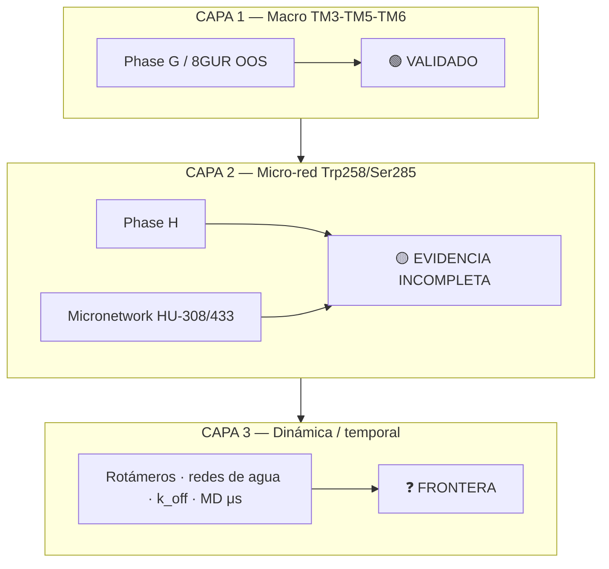

# SÍNTESIS DE FRONTERA METODOLÓGICA — CB₂

**ESTADO:** `RESEARCH_CONSOLIDATED_AT_FRONTIER` → ver freeze autoritativo en raíz  
**Fecha:** 2026-08-20 (síntesis); **lectura final / congelación científica:** 2026-08-21  
**Modo:** Documental / READ-ONLY — **sin docking, sin de_novo, sin modificación de umbrales; pipelines computacionales PAUSADOS**  
**Audiencia:** PI y colaboradores que citen el estado consolidado del programa Janusforge

> **Autoridad de freeze (2026-08-21):** [`RESEARCH_STATE.md`](../RESEARCH_STATE.md) — **`RESEARCH_STATUS = FROZEN_AT_EPISTEMOLOGICAL_BOUNDARY`**. Hipótesis de trabajo (ligando × paisaje × membrana; pesos **no** resueltos) — **no** modelo tripartito final ni termodinámica CB2 resuelta. Flags: `LINE_PAUSE = TRUE`, `NEW_PHASE = DO_NOT_OPEN`, `COMPUTATION_ACTIVE = NONE`, `STATIC_LIGACN = CORE_TOPOLOGICAL_ONLY`, `MEMBRANE_MILIEU = FUTURE_HYPOTHESIS`. Este documento permanece como síntesis de frontera metodológica previa; **no** autoriza compute ni nueva fase.

---

## Narrativa central

Este trabajo se sitúa en la **historia de la farmacología CB₂**, no como un “descubrimiento” aislado. La activación del receptor cannabinoide tipo 2 no es una fotografía binaria estática: es un **continuo dinámico de microestados conformacionales** cuya expresión funcional (Gi, sesgo de señal, cinética) depende del contexto estructural observado.

La calibración multiconformacional y las fases G–H–micronetwork demuestran que:

- **6KPF** (agonista E3R + Gi, cryo-EM) **captura** la divergencia Trp258/Ser285 entre HU-308 y HU-433 que la literatura describe para el par enantiomérico C3/C1.
- **6PT0** (cristal rígido WIN 55,212-2 + Gi) **enmascara** esa divergencia → el docking estático/semi-flexible alcanzó su **límite de resolución física** como predictor determinista de eficacia Gi.

El Contract v1.0 (`configs/thcv_design_constraints.yaml`) colapsó como **predictor funcional** pero permanece **congelado como testigo histórico** del observador estático 6PT0 — no como ley mecanística universal.

---

## Cadena de tres capas



**Resumen ASCII:**

```
CAPA 1  Macro TM3-TM5-TM6     → 🟢 VALIDADO     (Phase G / 8GUR OOS GENERALIZES, ~2.32 norm)
CAPA 2  Micro-red Trp258/Ser285 → 🟡 EVIDENCIA INCOMPLETA (Phase H INDETERMINATE; micronetwork INDETERMINATE — 6KPF DISTINCT, 6PT0 IDENTICAL)
CAPA 3  Dinámica/temporal      → ❓ FRONTERA     (rotámeros, redes de agua, k_off, MD μs)
```

---

## 1. Logros validados

### 1.1 Coordenada macro TM3–TM6 generalizable out-of-sample

**Phase G** (`results/conformational/fase_g_generalization_report.md`) valida que la huella conformacional CB₂ en el espacio TM3–TM5–TM6 **separa activo de inactivo** en el ciego **8GUR** (CP55,940 + Gi, 2.84 Å cryo-EM):

| PDB | Estado | Distancia normalizada |
|-----|--------|----------------------|
| 6PT0 | activo WIN + Gi | 2.3019 |
| 6KPF | activo cryo-EM | 2.3019 |
| **8GUR** (blind OOS) | activo CP55,940 + Gi | **2.3205** |
| 5ZTY | inactivo/antagonista | 3.9501 |

**Veredicto Q1:** `GENERALIZES` — Δ(blind→inactivo) = 1.630 unidades normalizadas.

### 1.2 Eliminación formal de artefactos geométricos estáticos

- **Contract v1.0** colapsó como **predictor** de eficacia Gi / clase funcional ordinal (Phase H H1: `INDETERMINATE`).
- Permanece **FROZEN** como **testigo** del observador estático 6PT0 + proxies THCV/HU-308 — no se retunea (mantra: **calibrar ≠ retocar**).
- Phase B (`results/docking/audit_qiu_decoupled_layers.md`) documentó rechazo **concomitante** estructural + periférico en el set Qiu; la vía ortostérica rígida quedó archivada (Fases A–E `CLOSED_AND_ARCHIVED`).

### 1.3 Integración con literatura primaria

| Evidencia | Implicación |
|-----------|-------------|
| Par **HU-308 / HU-433** (enantiómeros C3/C1) | Caso pareado de disociación afinidad ↔ eficacia Gi documentada en primarios (Hanus 1999; Soethoudt et al. 2017 Nat Commun) |
| **Trp258** como nodo de modulación | Coherente con trabajo reciente en derivados CB₂; la micro-red Trp258/Ser285/Phe183 emerge como capa intermedia, no como simple proxy de distancia |
| Calibración multistate | HU-433 y O-1966 explicables en estados alternativos (6KPF, 8GUR) pero no bajo el snapshot rígido 6PT0 — ver [`cb2_multistate_calibration_synthesis.md`](cb2_multistate_calibration_synthesis.md) |

---

## 2. Límites demostrados

### 2.1 Docking estático / semi-flexible vs plasticidad micro-interaccional

El docking estático y semi-flexible **no puede convertir** interacciones micro-plásticas (Trp258 rotámeros, contactos Ser285, redes de agua locales) en un **predictor determinista de eficacia Gi** sin incorporar **dinámica explícita**.

Evidencia convergente:

| Fase | Veredicto | Hallazgo clave |
|------|-----------|----------------|
| **H** (ordinal funcional) | `INDETERMINATE` | HU-433 sin fila Gi comparable forzada; proyección conformacional insuficiente para separar tiers TOTAL/PARTIAL/INVERSE (≥3 proyecciones requeridas, 1 obtenida) |
| **Micronetwork** HU-308 vs HU-433 | `INDETERMINATE` | **6PT0 = IDENTICAL_LOCAL_MODES**; **6KPF = DISTINCT_LOCAL_MODES** — discrepancia de plasticidad de estado, no ley del par enantiomérico |

### 2.2 Implicación metodológica

> La resolución alcanzada por el stack estático (Vina + Contract v1.0 + proxies de distancia) es **suficiente para discriminar macro-estados** (activo vs inactivo) pero **insuficiente para inferir eficacia funcional** a partir de microdescriptores locales sin dinámica.

No promover `DISTINCT_LOCAL_MODES` en 6KPF como regla general del par HU-308/HU-433; la discrepancia 6PT0/6KPF es evidencia de **plasticidad conformacional**, no de fallo técnico aislado.

---

## 3. Candados permanentes

```yaml
DE_NOVO_GENERATION: STOP
THRESHOLD_MODIFICATION: STOP
CONTRACT_v1.0: FROZEN
COMPUTATIONAL_PIPELINES: PAUSED
RESEARCH_STATUS: RESEARCH_CONSOLIDATED_AT_FRONTIER
```

| Parámetro | Estado | Fuente |
|-----------|--------|--------|
| `DE_NOVO_GENERATION` | **STOP** | [`switch_hypothesis_allosteric_reformulation.md`](switch_hypothesis_allosteric_reformulation.md) |
| `THRESHOLD_MODIFICATION` | **STOP** | Idem |
| `CONTRACT_v1.0` | **FROZEN** | `configs/thcv_design_constraints.yaml`; testigo histórico |
| `COMPUTATIONAL_PIPELINES` | **PAUSED** | Orden PI 2026-08-20; HALT docking/generación/MD nuevos |
| `RESEARCH_STATUS` | **RESEARCH_CONSOLIDATED_AT_FRONTIER** | Este documento |

---

## 4. Mapa de documentos vinculados

| Documento | Rol en la síntesis |
|-----------|-------------------|
| [`JANUSFORGE_RESEARCH_STATE.md`](JANUSFORGE_RESEARCH_STATE.md) | Bitácora maestra; gobernanza congelada; veredictos G/H/micronetwork |
| [`cb2_multistate_calibration_synthesis.md`](cb2_multistate_calibration_synthesis.md) | Cierre calibración multiconformacional 2026-08-19; panel 6PT0/6KPF/5ZTY/8GUR |
| [`epistemic_balance_calibration_2026-08-19.md`](epistemic_balance_calibration_2026-08-19.md) | Balance epistemológico; calibrar ≠ retocar; `ALLOSTERIC_FRAMEWORK = HYPOTHESIS_PENDING_CALIBRATION` |
| [`switch_hypothesis_allosteric_reformulation.md`](switch_hypothesis_allosteric_reformulation.md) | Reformulación SWITCH; pregunta motriz alostérica; gobernanza Contract FROZEN |
| [`cb2_allosteric_switch_map.md`](cb2_allosteric_switch_map.md) | **Hipótesis only** — mapa de rutas alostéricas divergentes CB₁/CB₂; espacio futuro, no pipeline activo |
| `results/conformational/fase_g_generalization_report.md` | Phase G — generalización 8GUR OOS |
| `results/conformational/fase_h_ordinal_functional_report.md` | Phase H — auditoría ordinal H0/H1; veredicto INDETERMINATE |
| `results/conformational/micronetwork_modes_report.md` | Micronetwork HU-308/433; plasticidad 6PT0 vs 6KPF |
| `results/docking/audit_qiu_decoupled_layers.md` | Phase B — capas desacopladas; Contract como testigo |

---

## 5. Frontera abierta (Capa 3)

La investigación queda **consolidada en la frontera** entre evidencia macro validada y micro-evidencia incompleta. La Capa 3 — dinámica temporal — permanece **explícitamente abierta** y **fuera del alcance del stack estático actual**:

- Rotámeros de Trp258 y redes de agua estructurales
- Cinética de unión/desunión (`k_off`, residencia)
- Simulaciones MD en escala μs con muestreo de estados múltiples
- Correlación pose ↔ tier funcional Gi con ensayos comparables (H0 gaps: HU-433, THCV)

Cualquier reanudación computacional requiere **orden PI explícita** y no modifica los candados de §3.

---

## 6. Trazabilidad Git

| Campo | Valor |
|-------|-------|
| Rama de consolidación | `feat/micronetwork-falsification-test` |
| Fase G | `results/conformational/fase_g_generalization_report.md` |
| Fase H | `results/conformational/fase_h_ordinal_functional_report.md` @ `72b6e69` |
| Micronetwork | `results/conformational/micronetwork_modes_report.md` @ `4bacec0` |

---

*Fin síntesis de frontera metodológica CB₂. Documento de consolidación PI — no autoriza cómputo nuevo ni reinterpretación de veredictos INDETERMINATE como PASS/FAIL.*
