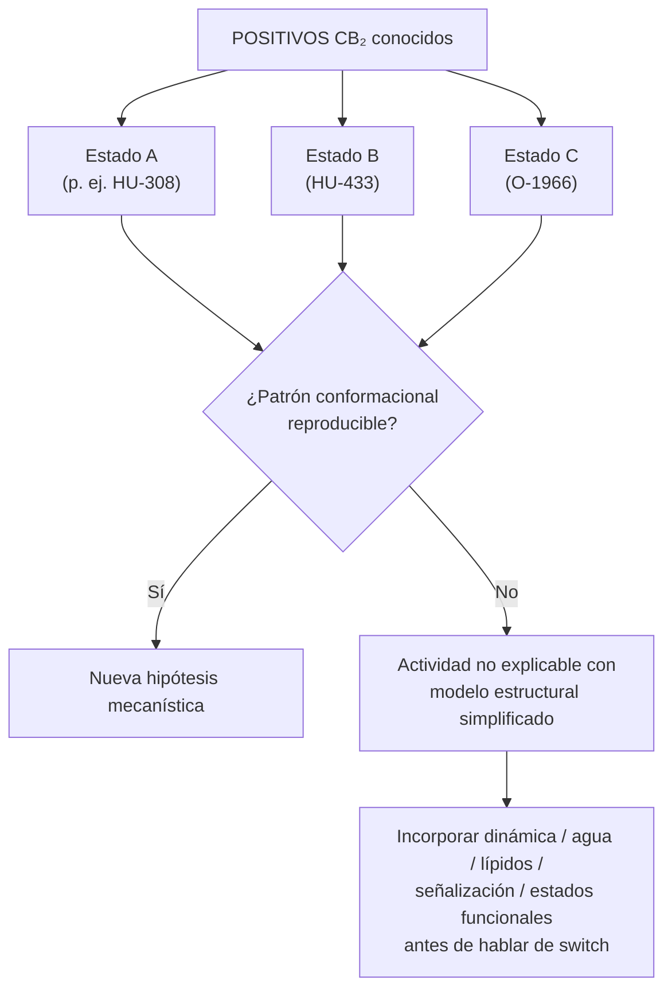

# Balance epistemológico y hoja de ruta de calibración

**Fecha de emisión:** 2026-08-19  
**Modo:** Documental / Gobernanza metodológica — **sin ejecución computacional, sin moléculas nuevas, sin retune de umbrales**  
**Audiencia:** PI y colaboradores que citen el estado del programa Janusforge

---

## 1. Conclusión central (precisa)

**No** afirmamos que «el docking es inútil». Afirmamos lo siguiente:

> **Contract / modelo v1.0 describe una hipótesis geométrica estática concreta; la actividad CB₂ documentada en literatura no está necesariamente contenida dentro de esa hipótesis.**

El Contract v1.0 (`configs/thcv_design_constraints.yaml`, `docs/thcv_design_constraints.md`) codifica proxies estéricos medidos contra **5TGZ** (CB₁ antagonista/inactivo) y **6PT0** (CB₂ agonista/acoplado Gi, referencia WIN 55,212-2). Es un **modelo de observación** de un snapshot cristalográfico, no un teorema sobre todos los modos de activación CB₂.

---

## 2. Distinción semántica (definitiva)

| Proposición | Veredicto epistemológico |
|-------------|--------------------------|
| `STRUCTURAL_BINDING = PASS` implica «será un fármaco activo» | **FALSO** — confunde afinidad/pose proxy con eficacia funcional |
| `STRUCTURAL_BINDING = PASS` implica «satisface el envolvente estérico estático de la hipótesis v1.0» | **VERDADERO** — definición operativa del contrato |
| FAIL de HU-433 / O-1966 (lit-activos CB₂) = error de molécula o sesgo del clasificador | **FALSO** — es evidencia de que la activación CB₂ admite paisajes conformacionales **más allá** del pose de referencia estático 6PT0 + reglas v1.0 |

**Mantra de estado (no confundir con verdad mecanística):**

```text
ALLOSTERIC_FRAMEWORK = HYPOTHESIS_PENDING_CALIBRATION
```

**No** escribir `ALLOSTERIC_FRAMEWORK = TRUE`. El marco alostérico permanece **hipótesis abierta pendiente de calibración**, no conclusión demostrada.

---

## 3. Calibrar ≠ retocar (distinción operativa — OBLIGATORIA)

> **Calibrar ≠ retocar.**

Esta distinción es el eje de la etapa actual. Confundirla invalida la gobernanza del Contract v1.0 congelado.

### Pregunta legítima de calibración multi-estado

La calibración multi-estado pregunta:

> **¿Qué conformaciones del receptor permiten explicar los positivos conocidos que el modelo estático v1.0 no explica?**

### Pregunta prohibida (retune disfrazado de ciencia)

**NO** pregunta:

> **¿Qué parámetros tengo que cambiar para que HU-433 y O-1966 pasen?**

Retocar umbrales, grids, proxies geométricos o reglas contractuales para forzar PASS de lit-activos conocidos **no es calibración** — es **ajuste post-hoc** que destruye el poder falsificador del contrato congelado y protege contra el overfitting de Contract v1.0.

```text
CALIBRACIÓN  =  explorar espacio conformacional del receptor (observador)
RETOCAR      =  mover reglas hasta que casos incómodos desaparezcan (overfitting)

ALLOSTERIC_FRAMEWORK = HYPOTHESIS_PENDING_CALIBRATION   # NOT TRUE
```

Ver también: [`switch_hypothesis_allosteric_reformulation.md`](switch_hypothesis_allosteric_reformulation.md) §1 (gobernanza `THRESHOLD_MODIFICATION: STOP`).

---

## 4. Criterios de éxito de esta etapa

**No** necesitamos que todos los activos conocidos encajen en **una sola** conformación.

Sería **más informativo** encontrar un patrón del tipo:

```text
POSITIVOS CB₂
├── Estado A  (p. ej. HU-308)
├── Estado B  (HU-433)
└── Estado C  (O-1966)
    └── → ¿patrón conformacional reproducible?
```

### Árbol de resultados posibles



| Resultado | Interpretación | Siguiente paso epistemológico |
|-----------|----------------|-------------------------------|
| **Patrón reproducible** (p. ej. residuos/volumen/contactos conservados por estado) | Evidencia de **reglas estructurales reales** más allá del snapshot 6PT0 | Formular hipótesis mecanística nueva — **sin** reclamar `ALLOSTERIC_FRAMEWORK = TRUE` |
| **Sin patrón reproducible** | La actividad CB₂ documentada **no puede explicarse satisfactoriamente** con nuestro modelo estructural simplificado | Incorporar dinámica, agua, lípidos, señalización y estados funcionales **antes** de hablar de un conmutador molecular |

Ambos resultados son **informativos**. Un resultado negativo no es un fallo del programa — delimita el alcance del observador estático v1.0.

---

## 5. Contraste de etapa

| Etapa anterior (A–E, diseño ortostérico) | Etapa actual (calibración multi-estado) |
|------------------------------------------|----------------------------------------|
| **Encontrar una molécula que satisfaga las reglas** que escribimos | **Descubrir cuáles son las reglas reales** del receptor |
| Éxito = PASS contractual bajo 6PT0 + proxies v1.0 | Éxito = patrón conformacional reproducible **o** evidencia de límite del modelo simplificado |
| HU-433 / O-1966 como contradicciones a eliminar | HU-433 / O-1966 como **casos de calibración** que delimitan el observador |
| Riesgo: overfitting de Contract v1.0 | Protección: `CONTRACT_v1.0: FROZEN`, `THRESHOLD_MODIFICATION: STOP` |

```text
ANTES                          AHORA
─────                          ─────
¿Qué molécula gana?     →      ¿Qué reglas gobiernan el receptor?
¿Cómo paso el test?     →      ¿Qué estados explican los positivos?
Retune si falla         →      Calibrar sin retocar
```

---

## 6. Valor de las discrepancias — casos de calibración, no de «arreglar el clasificador»

HU-433, O-1966 y HU-308 (referencia gold lit-activa) son los hallazgos retrospectivos **más valiosos** de la Fase E. **No** son moléculas a las que hay que «hacer pasar» el clasificador; son **casos de calibración biophysical** que delimitan el alcance del modelo estático.

### 6.1 Panel lit-activo CB₂ (calibración)

| Compuesto | Rol | Experimental (lit) | Score CB1 | Score CB2 | STRUCTURAL | PERIPHERAL | Cuadrante | GLOBAL | Fuente |
|-----------|-----|-------------------|-----------|-----------|------------|-----------|-----------|--------|--------|
| **HU-308** | Referencia gold lit-activa + pose de persistencia Contract v1.0 | CB₂ agonista selectivo; Ki CB₂ ~22.7 nM (Hanuš 1999); EC50 cAMP ~5.57 nM | −6.46 | −9.46 | *(referencia geométrica Exam A; no panel Phase E)* | — | — | — | `results/docking/benchmark_gold_exam_a.md` |
| **HU-433** | Caso de calibración | CB₂ agonista selectivo; Ki CB₂ 12.2 nM vs HU-308 22.7 nM (patente US20110269842); sin CB₁ apreciable (Hanus 2015) | −6.93 | −9.87 | **FAIL** | **FAIL** (TPSA 38.69 Ų) | **Q4** | **FAIL** | `results/docking/screening_patents_thcv_fase_e.md` |
| **O-1966** | Caso de calibración | CB₂ agonista parcial selectivo; Ki CB₂ 23±2.1 nM; EC50 GTPγS 70±14 nM; Emax 74±5% vs CP55,940 (Wiley 2002; Zhang 2007) | −7.75 | −8.91 | **FAIL** | **FAIL** (TPSA 38.69 Ų) | **Q4** | **FAIL** | `results/docking/screening_patents_thcv_fase_e.md` |

**Sub-checks estructurales relevantes (Phase E, bajo 6PT0 estático):**

- **HU-433:** CB1 C9/C11 Δvol 6.0 Å (>1.0); CB2 C3 occupancy 6.75 Å (>2.5); TPSA 38.69 Ų (<70).
- **O-1966:** CB1 C9/C11 Δvol 1.5 Å (>1.0); CB2 C3 occupancy 7.28 Å (>2.5); TPSA 38.69 Ų (<70).

**Contraste con HU-308 (Exam A, mismo protocolo estático):** HU-308 acerca Ser285 a 3.33 Å y define el marco de persistencia de pose (`centroid ≤ 2.0 Å` vs referencia HU-308). Los lit-activos patentados **fallan** ocupación C3 y/o delta volumétrico CB1 pese a actividad CB₂ documentada.

**Interpretación epistemológica:** La discrepancia lit-activo ↔ FAIL contractual **no invalida** la literatura ni «demuestra» alosteria. Señala que el **observador estático** (grid 6PT0 + proxies THCV/HU-308) **no agota** el espacio de poses ortostéricas y estados receptor compatibles con agonismo CB₂.

JSON Phase E: `results/docking/screening_patents_thcv_fase_e/screening_patents_fase_e.json`

---

## 7. Precaución crítica — no cerrar el mecanismo demasiado pronto

**No** tratar el FAIL de HU-433 / O-1966 bajo v1.0/6PT0 como mecanismo alostérico **demostrado**.

Las explicaciones alternativas permanecen **abiertas en paralelo** hasta discriminación experimental o computacional dirigida:

1. **Induced fit** — el pocket se reorganiza al unir ligando activo.
2. **Plasticidad del bolsillo** — volumen y forma distintos al snapshot 6PT0.
3. **Otra pose ortostérica** — orientación/ligando compatible con actividad sin satisfacer proxies v1.0.
4. **Otro estado del receptor** — población conformacional no representada por 6PT0 (p. ej. 5ZTY, 6KPC, 8GUR/8GUS).
5. **Señalización diferencial** — Gi / cAMP / β-arrestina sin transición completa de la red de microswitches clásica.
6. **Modulación alostérica** — sitio extraortostérico o modulador de equilibrio de estados.

**Trabajo restante = discriminar estas hipótesis, no elegir una prematuramente.**

El FAIL contractual es **evidencia de límite del modelo estático**, no un veredicto mecanístico único.

---

## 8. Cierre conceptual del bloque retrospectivo A–E

Tras Fases A–E (`results/docking/`):

- **Contract v1.0 NO falsificado** en ningún panel retrospectivo (Q1 = 0 en A–D y Phase E).
- **Desacoplamiento de capas demostrado** (estructural ≠ periférico ≠ funcional) — ver `audit_qiu_decoupled_layers.md`, `external_audit_four_quadrants.md`.
- **Discrepancias lit-activo vs grid estático** (HU-433, O-1966) son el **producto más informativo** del cierre, no un fallo a corregir retuneando umbrales.

**Idea de cierre:** Ya no intentamos fabricar una molécula que gane un juego de reglas que escribimos nosotros; intentamos aprender **qué reglas del receptor son invariantes** frente a **artefactos de observar una sola conformación cristalográfica**. Ver §3 (calibrar ≠ retocar), §4 (criterios de éxito) y §5 (contraste de etapa).

---

## 9. Pregunta de calibración (siguiente maduración — solo encuadre analítico)

Usar el conjunto lit-activo CB₂ **{HU-308, HU-433, O-1966}** como **panel de calibración biofísica**. Tres ramas de preguntas (**sin ejecución en este documento**):

### Rama 1 — Plasticidad del bolsillo / induced fit vs grid rígido

¿Los activos conocidos ocupan volúmenes que **aparecen o desaparecen** al comparar estados estructurales CB₂, no solo al desplazar el ligando dentro de 6PT0?

### Rama 2 — Microswitches alternativos

¿Es **Ser285** requisito universal para estados funcionales favorables CB₂, o existen rutas con contactos conservados distintos (p. ej. red Phe117 / Trp258 / Thr114) sin contacto Ser285 clásico?

### Rama 3 — Sesgo de vía / eficacia funcional

¿Puede Gi / GTPγS / cAMP activarse con **transición parcial** de la red ortostérica clásica (agonismo parcial, sesgo de vía) sin el paquete geométrico exigido por v1.0?

---

## 10. Siguiente experimento computacional lógico (MARCO ÚNICAMENTE — no ejecutar)

**Antes de diseñar cualquier molécula**, comparar activos conocidos contra **múltiples estados conformacionales CB₂**, no solo 6PT0 estático.

### 10.1 Secuencia de preguntas (encuadre)

| Paso | Pregunta | Estado bajo v1.0 / 6PT0 |
|------|----------|---------------------------|
| 1 | ¿Encaja HU-433? | **NO** (STRUCT FAIL; Q4) |
| 2 | ¿Encaja O-1966? | **NO** (STRUCT FAIL; Q4) |
| 3 | ¿Qué cambia en el receptor? | *Pendiente — panel multi-estado* |

Luego, **solo** buscar explicaciones para positivos conocidos:

- ¿Qué residuos se mueven entre estados?
- ¿Qué volumen aparece o desaparece?
- ¿Qué contactos se conservan entre ligandos activos?
- ¿Ser285 es requisito universal o contextual?
- ¿Existen rutas alternativas a estados funcionales?
- ¿Las diferencias encajan mejor con **induced-fit ortostérico** o con **regulación alostérica**?

**Objetivo:** caracterizar el espacio conformacional **real** antes de formular nuevas geometrías de diseño.

### 10.2 Panel propuesto de estructuras CB₂ (calibración futura — solo bibliografía / punteros de repo)

| PDB | Estado / ligando | Resolución | Notas | Punteros en repo |
|-----|------------------|------------|-------|------------------|
| **6PT0** | Agonista WIN 55,212-2 + Gi | cryo-EM ~3.2 Å | **Referencia actual** Contract v1.0; grid `configs/grid_cb2_6pt0.txt` | `configs/cb1_cb2.yaml`; `data/targets/cb2/6PT0_clean.pdbqt`; `src/targets/prep.py` |
| **6KPC** | Agonista AM12033-class (**E3R**) | X-ray ~3.2 Å | Segundo agonista cristalino; bolsillo alternativo | `data/targets/cb2/6KPC_clean.pdbqt`; `configs/grid_cb2_6kpc.txt`; `target_prep_redock_manifest.json` |
| **6KPF** | Agonista + Gi (alternativa 6PT0) | cryo-EM | Complementaria agonista-bound | `docs/literatura_fibrosis_cb1_cb2.md` §9 |
| **8GUR** | CP55,940–CB₂–G | cryo-EM ~2.8 Å | Agonista clásico en complejo de señalización | `results/reports/qiu_0p_external_evidence_table.md`; DOI 10.1038/s41467-023-37112-9 |
| **8GUS** | **HU-308**–CB₂–G | cryo-EM ~3.0 Å | **Directamente relevante** para calibración gold lit-activa | idem |
| **8GUQ** | APD371/Olorinab (**KNF**) | cryo-EM | Agonista β-arrestina-biased; ligando extraído en prep | `data/targets/cb2/8GUQ_apd371_ligand.pdb`; `src/targets/prep.py` REF_LIGAND_SPECS |
| **5ZTY** | Antagonista AM10257 | X-ray ~2.8 Å | Estado inactivo/antagonista — contraste Yin-Yang | `configs/cb1_cb2.yaml` (contraste); `docs/literatura_fibrosis_cb1_cb2.md` §9 |

**Ligandos de calibración propuestos (solo positivos conocidos):** HU-308, HU-433, O-1966 (+ opcionalmente CP55,940, WIN 55,212-2 como controles de estructura co-cristalizada).

**Prohibición explícita en esta fase:** no ejecutar docking, no generar grids nuevos operativos, no retunar umbrales, no proponer sustituyentes PAM/NAM.

---

## 11. Gobernanza del proyecto

```yaml
# BALANCE GENERAL DEL PROYECTO (2026-08-19)
ESTADO DE EJECUCIÓN:
  CALIBRATION_MULTI_STATE: CLOSED   # síntesis: docs/cb2_multistate_calibration_synthesis.md
  ORTHOSTERIC_THCV_DESIGN: PAUSED
  RETROSPECTIVE_AUDIT_PHASES_A_E: CLOSED_AND_ARCHIVED
  CONTRACT_v1.0: FROZEN
  DE_NOVO_GENERATION: STOP
  THRESHOLD_MODIFICATION: STOP
MARCO CONCEPTUAL:
  SWITCH_HYPOTHESIS: OPEN
  ALLOSTERIC_FRAMEWORK: HYPOTHESIS_PENDING_CALIBRATION
  EXPERIMENTAL_VALIDATION: REQUIRED
PRÓXIMO ENFOQUE:
  - Validación experimental / nuevas hipótesis fuera de Contract v1.0 (no retune).
  - No generar moléculas nuevas.
```

**Nota sobre ortostérico:** `ORTHOSTERIC_THCV_DESIGN: PAUSED` significa **pausado, no descartado**. El corpus THCV y Contract v1.0 permanecen como evidencia histórica congelada.

---

## 12. Trazabilidad

| Tema | Ruta |
|------|------|
| Balance / calibración (este documento) | `docs/epistemic_balance_calibration_2026-08-19.md` |
| **Cierre calibración multistate CB₂** | `docs/cb2_multistate_calibration_synthesis.md` |
| Reformulación switch + alosteria | `docs/switch_hypothesis_allosteric_reformulation.md` |
| Phase E — patentes / lit THCV | `results/docking/screening_patents_thcv_fase_e.md` |
| Exam A — gold HU-308 | `results/docking/benchmark_gold_exam_a.md` |
| Auditoría cuadrantes A–D | `results/docking/external_audit_four_quadrants.md` |
| Contract v1.0 | `configs/thcv_design_constraints.yaml`, `docs/thcv_design_constraints.md` |
| Prep multi-estado CB₂ | `src/targets/prep.py`, `data/targets/target_prep_redock_manifest.json` |
| Tabla evidencia PDB CB₂ | `results/reports/qiu_0p_external_evidence_table.md` |
| Anclas estructurales | `docs/literatura_fibrosis_cb1_cb2.md` §9 |

---

*Fin `docs/epistemic_balance_calibration_2026-08-19.md`. Documento de gobernanza y calibración epistemológica únicamente.*
